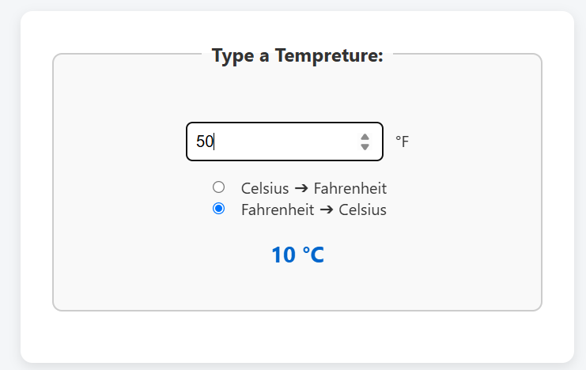
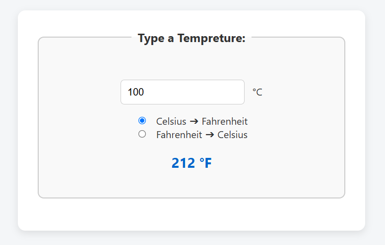
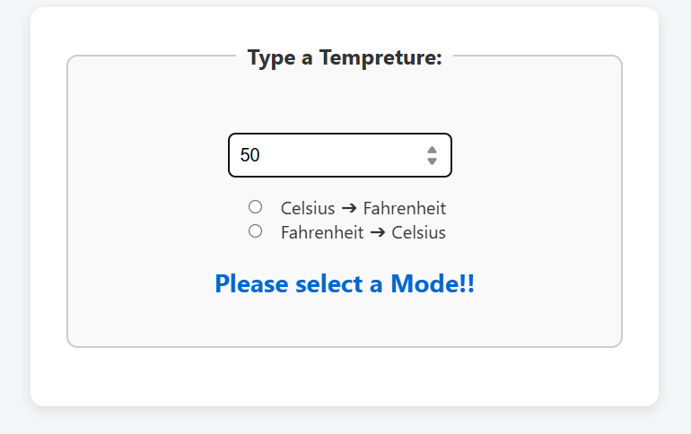

# 🌡️ Temperature Converter

A simple web-based temperature converter that allows you to convert values between **Celsius and Fahrenheit** instantly as you type.

---

## 🔧 Features

- Convert Celsius ➔ Fahrenheit
- Convert Fahrenheit ➔ Celsius
- Live result updates as you type
- Simple and user-friendly interface

---

## 🚀 How to Use

1. **Type a temperature** in the input box.
2. **Select a conversion mode**:
   - ✅ Celsius ➔ Fahrenheit
   - ✅ Fahrenheit ➔ Celsius
3. View the converted result instantly!

If no conversion mode is selected, the app will not display a result.

---

## 📸 Screenshots

### ✅ 1. Fahrenheit ➔ Celsius

### ✅ 2. Celsius ➔ Fahrenheit

### ⚠️ 3. No Option Selected

---

## 🛠️ Tech Stack

- HTML
- CSS
- JavaScript
