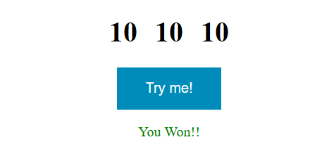
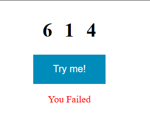

# 🎲 Roller Game

A simple and fun mini project built with JavaScript.  
Press the **"Try Me"** button — if all three numbers match, you win! Otherwise, you fail. 🎰

## 🖼 Screenshots

### ✅ Winning Example



### ❌ Failing Example



## 🚀 How It Works

- Click the **"Try Me"** button.
- Three random numbers (0–10) will be generated.
- If **all three numbers are the same**, you **win** 🎉.
- Otherwise, you **fail** ❌.

## 🧠 Tech Stack

- HTML
- CSS
- JavaScript

## ▶️ How to Run

1. Clone the repo:
   ```bash
   git clone https://github.com/FaroukBentaleb/Javascript-Mini-Projects.git
   ```
