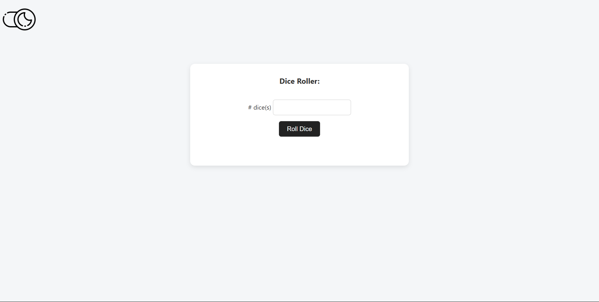

# 🎲 Dice Roller Game

A simple web-based Dice Roller game where users can enter the number of dice they want to roll, and get the results displayed as dice images. The app also includes light and dark mode toggle.

🔗 **Live Demo**: [https://dice-rollergame.netlify.app/](https://dice-rollergame.netlify.app/)

---

## ✨ Features

- 🎲 Roll 1 to many dice with a single click
- 🌙 Supports **Dark Mode** and **Light Mode**
- 📷 Displays random dice faces using clean SVG images
- 🧮 Dynamic input for number of dice
- ⚡ Instant results with no page reloads

---

## 🚀 How to Use

1. Visit the live site: [https://dice-rollergame.netlify.app/](https://dice-rollergame.netlify.app/)
2. Enter the number of dice you want to roll in the input field (e.g., `2`)
3. Click the **Roll Dice** button
4. View the randomly generated dice images

You can also toggle between **Light Mode** and **Dark Mode** using the theme switch buttons at the top or bottom of the interface.

---

## 🛠️ Technologies Used

- HTML
- CSS (custom styling for dark/light themes)
- JavaScript (DOM manipulation and randomization logic)

---

## 📸 Screenshot

